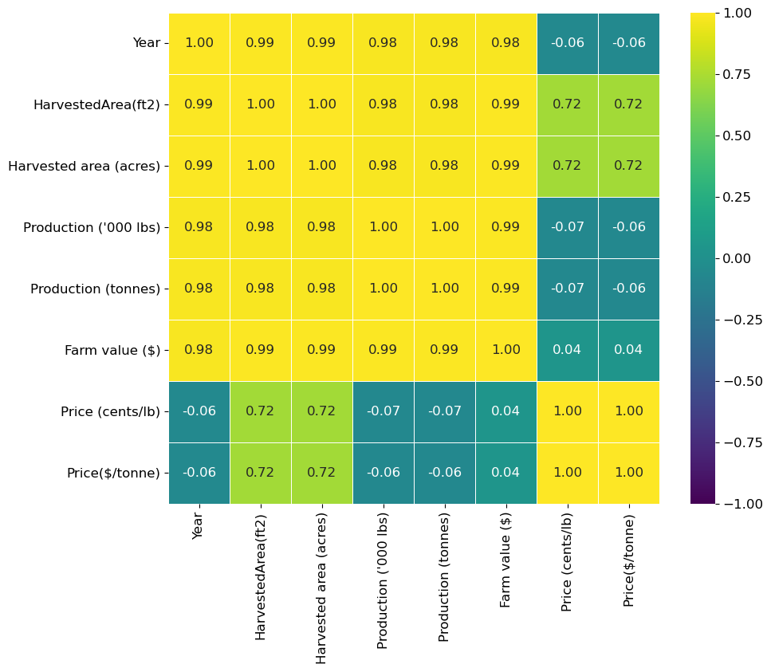
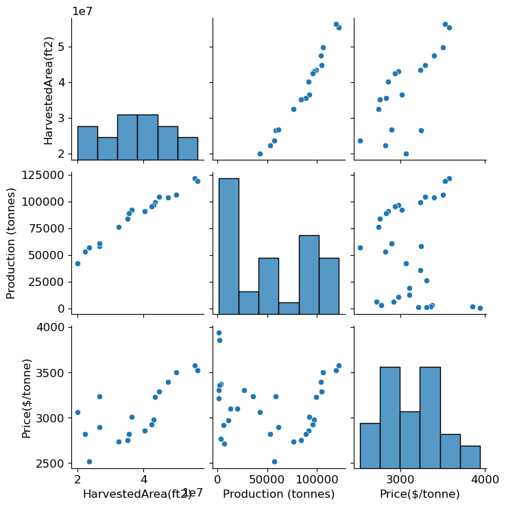
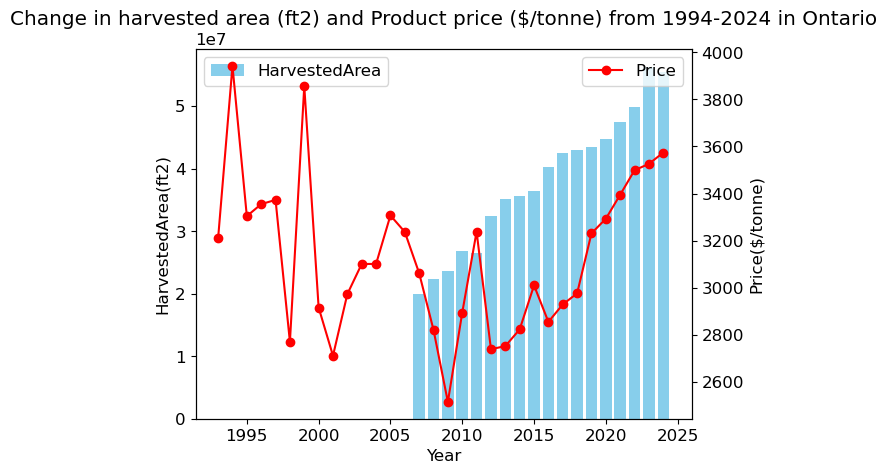

# Data Visualization

## Assignment 3: Final Project

### Requirements:
- We will finish this class by giving you the chance to use what you have learned in a practical context, by creating data visualizations from raw data. 
- Choose a dataset of interest from the [City of Toronto’s Open Data Portal](https://www.toronto.ca/city-government/data-research-maps/open-data/) or [Ontario’s Open Data Catalogue](https://data.ontario.ca/). 
- Using Python and one other data visualization software (Excel or free alternative, Tableau Public, any other tool you prefer), create two distinct visualizations from your dataset of choice.  
The data source: https://data.ontario.ca/dataset/aggregated-ontario-greenhouse-vegetable-production/resource/ab6ecf23-e711-48c8-ba61-5cae07a3dc3f.

Figure 1:The correlation between different featues of the dataset. 

Firgure 2: The correlation of Harvested area, price and production in Ontario.

Figures 3: The Change in harvested area and vegtabel area from 1994-2024 in Ontario. 
This plot shows the harvested area and price of vegetables in Ontario from 1994 to 2024. Data for harvested area is unavailable from 1994 to 2006, but from 2007 onward, there has been a general increase in harvested area. Vegetable prices peaked in 1995 and 1999, while 2009 recorded the lowest price during the observed period.

- For each visualization, describe and justify: 
    > What software did you use to create your data visualization?
I used python to plot the heatmap. 
    > Who is your intended audience? 
    My intended audience is researchers 
    > What information or message are you trying to convey with your visualization? 
   I aim to perform a correlation analysis to explore relationships between different features in the dataset.  
    > What aspects of design did you consider when making your visualization? How did you apply them? With what elements of your plots? 
    I ensured my visualization was easy to interpret by selecting appropriate colors, labels, and a clean layout. I applied this by using a high-contrast color( yellow and purple) scheme and ensuring text elements were legible without cluttering the plot. I considered colorblind-friendly palettes and readable fonts to ensure that the visualization was inclusive for all audiences. I used a heatmap to compare correlation between differernt features. I balanced spacing and proportions so that key patterns and relationships in the data were visible.

    > How did you ensure that your data visualizations are reproducible? If the tool you used to make your data visualization is not reproducible, how will this impact your data visualization? 
    I made sure my data visualizations are reproducible by documenting every step of the process, using standardized tools, and maintaining clear version control. I used open-source software such as Python with Matplotlib/Seaborn  so others can replicate my workflow.I included scripts or code snippets to regenerate the visuals, ensuring anyone with the same data and environment can reproduce them. If I used a proprietary or non-reproducible tool, it could limit others from recreating my visualization. This would impact reproducibility because adjustments or modifications to the visualization might be difficult without access to the same software.Long-term accessibility could be a concern if the tool becomes obsolete or loses support.
    
    > How did you ensure that your data visualization is accessible?  
    Ensuring accessibility in data visualization is key to making sure diverse audiences can interpret and engage with the information effectively. Here’s how I approached accessibility:
    1. Color Considerations: I used colorblind-friendly palettes to prevent misinterpretation by individuals with color vision deficiencies. 
    2. Clear Text & Labels: I ensured that all text, titles, and axis labels were legible by choosing appropriate font sizes and avoiding overly stylized fonts. I also provided direct annotations where necessary instead of relying only on legends.
    3. Alternative Formats: To support different accessibility needs, I included descriptive captions or text summaries explaining key insights from the visualization. This helps those who rely on screen readers or prefer text-based interpretations.
    4. Proper Scaling & Readability: I maintained an appropriate aspect ratio and spacing so that visual elements weren’t overcrowded or distorted, ensuring clarity across different devices and screen sizes.
    
    > Who are the individuals and communities who might be impacted by your visualization? 
    These are the people or groups including journalists, researchers, or policymakers  who will directly engage with the visualization.
    
    
    > How did you choose which features of your chosen dataset to include or exclude from your visualization? 
     Before visualizing the dataset, I printed the features to identify which ones were categorical and which were numerical. I observed that most features were numerical, which led me to explore potential correlations among them. I also noticed that two columns represented essentially the same data but in different units. To analyze meaningful relationships, I selected three features: Harvested Area (ft²), Production (tonnes), and Price ($/tonne), and proceeded to visualize the correlations between them.

    > What ‘underwater labour’ contributed to your final data visualization product?

     I conducted exploratory data analysis to identify variable types and understand their distributions. This included data cleaning tasks such as removing commas from numerical values and renaming feature titles to eliminate excessive spacing. I then performed correlation analysis to identify and select the most relevant features—Harvested Area, Production, and Price—and created a new DataFrame containing only these variables. Finally, I dedicated significant effort to formatting the visualization for clarity, including setting axis labels, applying appropriate color schemes, and adjusting scales to enhance interpretability.

Appendix (Python code)

import pandas as pd

# If the file is in the same folder:
df = pd.read_csv("/Users/minamahdian/Desktop/Documents/DSI folder /visualization/data1.csv")

# Show the first few rows
df.head()

# Import libraries
import numpy as np
import pandas as pd
import matplotlib.pyplot as plt
import seaborn as sns

# Assuming 'df' is your DataFrame

# Clean data set: Replace commas in numeric columns and convert to numeric
for column in df.columns:
    # Check if the column dtype is object (likely string) before applying .str
    if df[column].dtype == object:
        df[column] = pd.to_numeric(df[column].str.replace(',', ''), errors='coerce')
    else:
        # If not an object dtype, try converting directly to numeric
        df[column] = pd.to_numeric(df[column], errors='coerce')

# Calculate the correlation matrix
correlation_matrix = df.corr()

# Create the heatmap
plt.figure(figsize=(10, 8))
sns.heatmap(correlation_matrix, cmap='coolwarm')
plt.show()

# Create an annotated heatmap
plt.figure(figsize = (10,8))
plt.rcParams.update({'font.size': 12})
sns.heatmap(correlation_matrix, cmap = 'viridis', vmin = -1, vmax = 1, center = 0, annot=True, fmt=".2f", square=True, linewidths=.5)
plt.show()

# Edit the name of the coloumn 

df.rename(columns={"Harvested     Area       (square feet)": "HarvestedArea(ft2)", "Production (tonnes)": "Production (tonnes)","Average  Price         ($/tonne)":"Price($/tonne)","Harvested     Area       (acres)":"Harvested area (acres)"}, inplace=True)

- This assignment is intentionally open-ended - you are free to create static or dynamic data visualizations, maps, or whatever form of data visualization you think best communicates your information to your audience of choice! 
- Total word count should not exceed **(as a maximum) 1000 words** 
 
### Why am I doing this assignment?:  
- This ongoing assignment ensures active participation in the course, and assesses the learning outcomes: 
* Create and customize data visualizations from start to finish in Python
* Apply general design principles to create accessible and equitable data visualizations
* Use data visualization to tell a story  
- This would be a great project to include in your GitHub Portfolio – put in the effort to make it something worthy of showing prospective employers!

### Rubric:

| Component         | Scoring  | Requirement                                                                 |
|-------------------|----------|-----------------------------------------------------------------------------|
| Data Visualizations | Complete/Incomplete | - Data visualizations are distinct from each other - Data visualizations are clearly identified - Different sources/rationales (text with two images of data, if visualizations are labeled) - High-quality visuals (high resolution and clear data) - Data visualizations follow best practices of accessibility |
| Written Explanations | Complete/Incomplete | - All questions from assignment description are answered for each visualization - Explanations are supported by course content or scholarly sources, where needed |
| Code              | Complete/Incomplete | - All code is included as an appendix with your final submissions - Code is clearly commented and reproducible |

## Submission Information

🚨 **Please review our [Assignment Submission Guide](https://github.com/UofT-DSI/onboarding/blob/main/onboarding_documents/submissions.md)** 🚨 for detailed instructions on how to format, branch, and submit your work. Following these guidelines is crucial for your submissions to be evaluated correctly.

### Submission Parameters:
* Submission Due Date: `23:59 - 09/05/2025`
* The branch name for your repo should be: `assignment-3`
* What to submit for this assignment:
    * A folder/directory containing:
        * This file (assignment_3.md)
        * Two data visualizations 
        * Two markdown files for each both visualizations with their written descriptions.
        * Link to your dataset of choice.
        * Complete and commented code as an appendix (for your visualization made with Python, and for the other, if relevant) 
* What the pull request link should look like for this assignment: `https://github.com/<your_github_username>/visualization/pull/<pr_id>`
    * Open a private window in your browser. Copy and paste the link to your pull request into the address bar. Make sure you can see your pull request properly. This helps the technical facilitator and learning support staff review your submission easily.

Checklist:
- [ ] Create a branch called `assignment-3`.
- [ ] Ensure that the repository is public.
- [ ] Review [the PR description guidelines](https://github.com/UofT-DSI/onboarding/blob/main/onboarding_documents/submissions.md#guidelines-for-pull-request-descriptions) and adhere to them.
- [ ] Verify that the link is accessible in a private browser window.

If you encounter any difficulties or have questions, please don't hesitate to reach out to our team via our Slack. Our Technical Facilitators and Learning Support staff are here to help you navigate any challenges.

